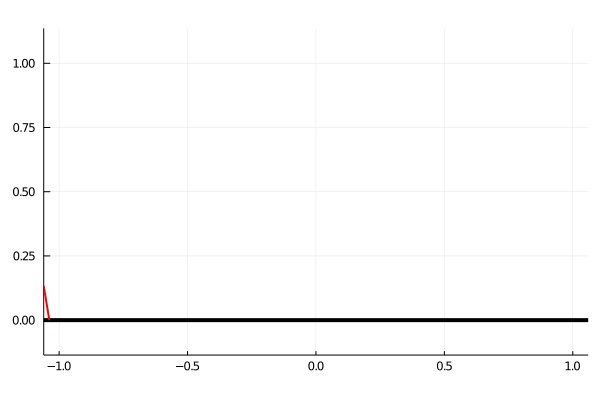
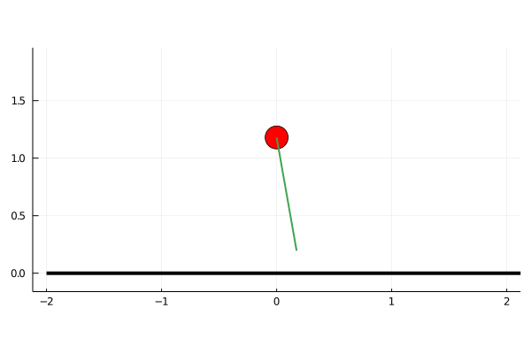

# biped

Pedagogical Julia scripts for deriving and solving equations of motion for bipedal robots

### Passive Dynamic walker simulation
Code can be found in `dynamics/passive_walker_sim.jl`

### Passive Spring Loaded Inverted Pendulum
Code can be found in `dynamics/slip_hopper_sim.jl`

